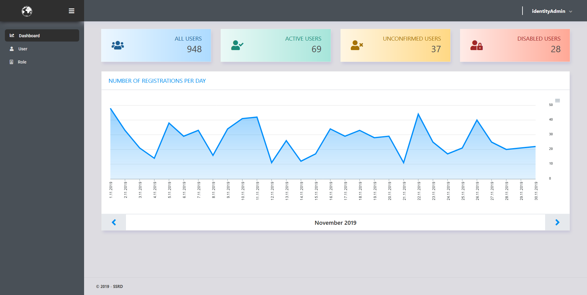

# IdentityUI
[](https://www.nuget.org/packages/SSRD.IdentityUI.Core/)

[](https://sonarcloud.io/dashboard/?id=ssrdio_IdentityUI&branch=master) 
[](https://sonarcloud.io/dashboard/?id=ssrdio_IdentityUI&branch=master) 
[](https://sonarcloud.io/dashboard/?id=ssrdio_IdentityUI&branch=master) 


IdentityUI is a simple platform for administrative management of users and admins with a graphical interface. It is easy to set up, has a clean API, and runs on all recent .NET Core releases.




## Nuget

Install SSRD.IdentityUI package [NuGet](https://www.nuget.org/packages/SSRD.IdentityUI/)

## AppSettings:

```json
"IdentityUI": {
  "BasePath": "http://localhost:5000",
  "Database": {
    "Type": "PostgreSql",
    "ConnectionString": "UserID={User};Password={Password};Host={IP};Port={Port};Database={DatabaseName};Pooling=true;"
  },
  "EmailSender": {
    "Ip": "{Ip}",
    "Port": "{Port}",
    "Username": "{Username}",
    "Password": "{Password}",
    "SenderName": "{Sender}"
  }
}
```
Supported databases: PostgreSQL, InMemory (only for testing)  
EmailSender options are optional if you provide custom implementation of IEmailSender

## Startup

In ConfigureServices add:
```c#
services.ConfigureIdentityUI(Configuration) // Configures IdentityUI. You can pass in your own identityUI options.
    .AddIdentityUI() // Adds IdentityManagement core services.
    .AddAuth() // Adds Authentication. You can pass in your own CookieAuthenticationOptions.
    .AddEmailSender() // Optional if you provide  custom implementation of IEmailSender
    .AddIdentityAdmin() // Adds services for IdentityAdminUI
    .AddAccountManagement(); // Adds services for AccountManagment.
```

In Configure add:
```c#
app.UseIdentityUI(enableMigrations: false) // Adds IdentityUI   
```

.NET Core 2:  
In `app.UseMvc()` add
```c#
routes.MapAccountManagement(); // Adds AccountManagement UI
routes.MapIdentityAdmin(); // Adds IdentityAdmin UI
```

.NET Core 3:  
In `app.UseEndpoints()` add
```c#
endpoints.MapAccountManagement(); // Adds AccountManagement UI
endpoints.MapIdentityAdmin(); // Adds IdentityAdmin UI
```

You can create Database with migrations or without migrations `app.CreateIdentityDatabase();`

For adding admin `app.SeedIdentityAdmin("admin", "Password");`

**Important: If you are using .NET Core 3 remove `app.UseAuthorization()`;**

IdentityAdmin Dashboard: `{server}:{port}/IdentityAdmin/`  
Account managment: `{server}:{port}/Account/Manage/`

# Groups
From version 2.0 we are supporting a group/multi-tenant management. For this purpose, we created multiple group roles that are linked to permission inside group/tenant management. 

| Permission   |      Description     | 
|----------|:-------------:|
| group_can_manage_attributes |  Can mamange group attributes |
| group_can_remove_users |  Can remoce users from group |
| group_can_manage_roles |  User can assign roles inside the group |
| group_can_invite_users |  Can invite new users to this group |
| group_can_manage_invites |  Can see and edit invites |
| group_can_see_users |  User can see other members in group |
| identity_ui_can_manage_groups |  Can add new groups and can edit existing groups |
| group_can_add_existing_users |  Can add existing users. **Note**: This will expose all users from Identity server! |


# Advanced configuration

## IdentityUI options 

```c#
ConfigureIdentityUI(Configuration, endpoints => 
{
    endpoints.Home = "/";

    endpoints.Login = "/Account/Login/";
    endpoints.Logout = "/Account/Logout/";
    endpoints.AccessDenied = "/Account/AccessDenied/";

    endpoints.Manage = "/Account/Manage/";
    endpoints.ConfirmeEmail = "/Account/ConfirmEmail";
    endpoints.ResetPassword = "/Account/ResetPassword";

    endpoints.RegisterEnabled = true;
    endpoints.UseEmailSender = false;
}) // These are the default endpoints options.
```

## Identity policy 
```c#
AddIdentityUI(options =>
{
    options.Password.RequireDigit = false;
    options.Password.RequiredLength = 6;
    options.Password.RequiredUniqueChars = 0;
    options.Password.RequireLowercase = true;
    options.Password.RequireUppercase = true;
    options.Password.RequireNonAlphanumeric = false;

    options.SignIn.RequireConfirmedEmail = true;
    options.SignIn.RequireConfirmedPhoneNumber = false;

    options.Lockout.AllowedForNewUsers = true;
    options.Lockout.MaxFailedAccessAttempts = 5;
    options.Lockout.DefaultLockoutTimeSpan = TimeSpan.FromMinutes(5);
}) // These are the default identity options.
```

## IdentityUI options 

```c#
AddAuth(options => 
{
    options.Cookie.HttpOnly = true;
    options.LoginPath = "/Account/Login/";
    options.AccessDeniedPath = "/Account/AccessDenied/";
    options.SlidingExpiration = true;
    options.LogoutPath = "/Account/Logout/";
}) // These are the default cookie options.
```
# Support
For custom feature request or technical support contact us at [identity[at]ssrd.io](identity@ssrd.io)

## Credits

- [RoyalUI-Free-Bootstrap-Admin-Template](https://github.com/TemplateWatch/RoyalUI-Free-Bootstrap-Admin-Template)
